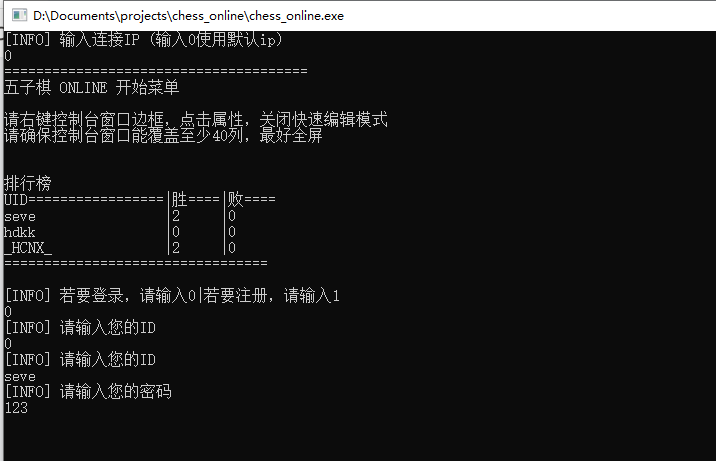
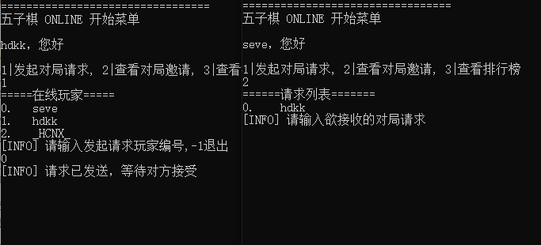
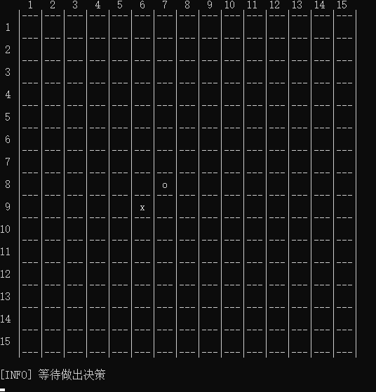
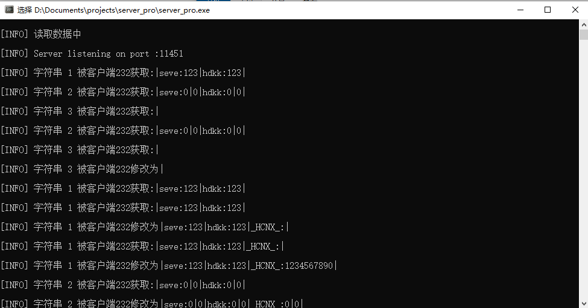

# gobang-Online

### 一个使用C++编写的控制台五子棋在线对战游戏。

## 项目结构

- **服务端**：存储数据信息, 处理客户端请求。
- **客户端**：提供用户界面，允许用户进行账号注册、登录、发起对战请求、进行游戏以及查看排行榜。

## 功能特性

1. **用户注册与登录**：
   - 用户可以通过客户端进行账号注册和登录。
   - 注册时需要输入用户名和密码，登录时需要输入用户名和密码进行验证。

2. **请求式对战**：
   - 用户登录后，可以发起对战请求。
   - 对战过程中，双方轮流下棋，直到一方获胜。

3. **排行榜**：
   - 系统记录用户的对战记录，并根据胜率生成排行榜。
   - 用户可以在客户端查看排行榜，了解当前排名。

## 使用说明

### 服务端部署

1. 克隆项目仓库，并进入服务端项目目录。
2. 编译服务端代码，生成可执行文件。
3. 运行服务端可执行文件，启动服务端服务。
4. 服务端从当前目录下读取data.txt来获取保存的玩家数据，服务端输入save指令以保存

### 客户端使用

1. 克隆项目仓库，并进入客户端项目目录。
2. 编译客户端代码，生成可执行文件。
4. 运行客户端可执行文件，进入用户界面。
5. 在用户界面进行账号注册、登录、发起对战请求以及查看排行榜等操作。

## 技术栈

- **编程语言**：C++
- **协议**：TCP/IP
- **开发工具**：RedPandaIDE

## 联系我们

如果你对 gobang-Online 项目有任何疑问或建议，可以通过以下方式联系我们：

- GitHub Issues：在 GitHub 项目仓库中提交 Issue。
- 电子邮件：发送邮件到 71415162@qq.com。

### 最后的话
作者高一，在学OI，英语不好，对象名会有很多拼错的单词，见谅。
